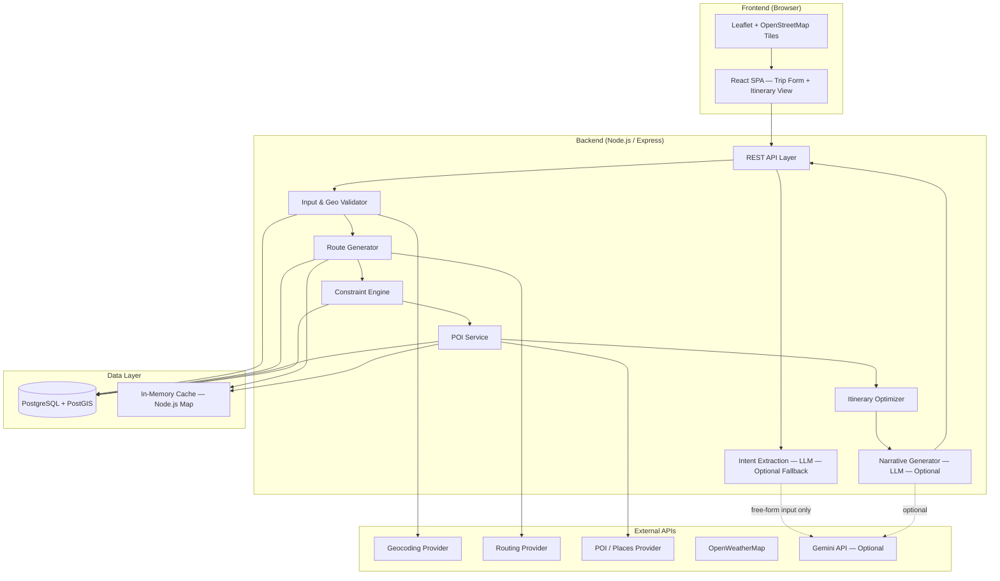
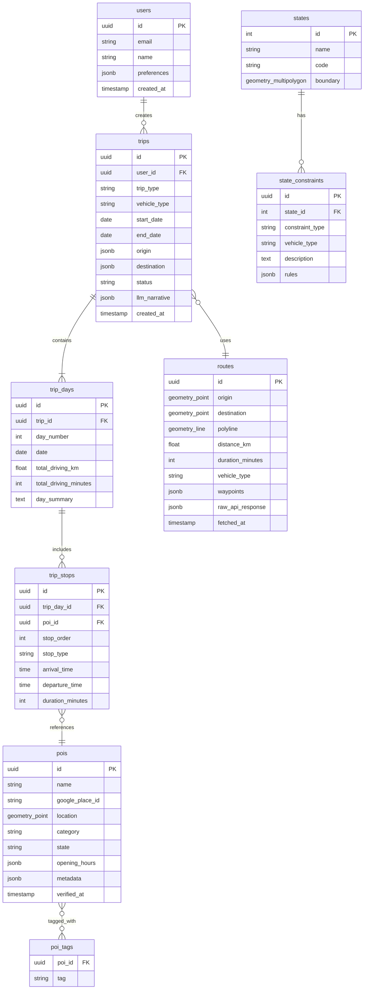
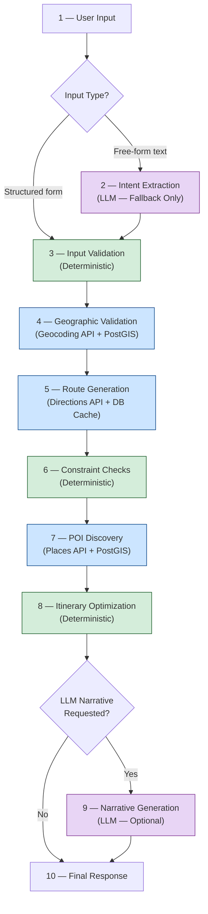

# Phase 1 — RouteWise Technical Architecture & Implementation Blueprint

---

## 1. Overall System Architecture



### Layer Responsibilities

| Layer | Responsibility |
|---|---|
| **Frontend** | Trip input form, interactive map display (Leaflet + OSM), itinerary rendering |
| **Backend API** | Orchestrates the full planning pipeline, enforces guardrails |
| **Database (PostgreSQL + PostGIS)** | Persistent storage of POIs, cached routes, constraints, user trips, spatial queries |
| **In-Memory Cache** | Simple Node.js `Map` for short-lived API response caching during a session (geocoding, route lookups) |
| **Geocoding Provider** | Resolves place names to verified coordinates (Google Maps Geocoding API) |
| **Routing Provider** | Computes driving routes, distances, durations, polylines (Google Maps Directions API) |
| **POI / Places Provider** | Discovers fuel stops, restaurants, attractions near routes (Google Maps Places API) |
| **Weather Provider** | Weather forecasts for travel dates (OpenWeatherMap) |
| **AI / LLM Layer** | **Optional** — Intent extraction from free-form text; narrative generation over verified data |

> **Provider Separation Principle**: Frontend map rendering, geocoding, routing, and POI discovery are four independent concerns. Each can use a different provider and can be swapped independently without affecting the others.

| Concern | MVP Provider | Can Swap To |
|---|---|---|
| **Frontend Map Tiles** | Leaflet + OpenStreetMap | Mapbox GL, Google Maps JS |
| **Geocoding** | Google Maps Geocoding API | Nominatim (OSM), Mapbox Geocoding |
| **Routing / Directions** | Google Maps Directions API | OSRM, Mapbox Directions |
| **POI / Places** | Google Maps Places API | Overpass (OSM), Foursquare |

---

## 2. Recommended Technology Stack

| Component | Technology | Rationale |
|---|---|---|
| **Frontend** | React 18+ with Vite | Fast dev server, widely known, large ecosystem |
| **Map Rendering** | Leaflet + OpenStreetMap tiles | Free, open-source, no API key required for base map tiles |
| **Styling** | Tailwind CSS | Utility-first, fast prototyping for student team |
| **Backend** | Node.js + Express.js | JavaScript end-to-end, simple REST API setup |
| **Language** | TypeScript (both frontend & backend) | Type safety without heavy overhead |
| **Database** | PostgreSQL 16+ with PostGIS extension | Industry-standard spatial database, free & open-source |
| **ORM / Query Builder** | Prisma (+ raw SQL for PostGIS queries) | Type-safe ORM for standard tables; raw SQL where PostGIS needs it |
| **Application Cache** | Node.js in-memory `Map` with TTL | Zero-dependency, sufficient for single-instance MVP |
| **LLM Provider** | Google Gemini API (gemini-2.0-flash or later) | Free tier generous for MVP, strong structured output support |
| **Geocoding & Routing** | Google Maps Platform (Directions, Geocoding, Places) | Most accurate India coverage; $200/month free credit |
| **Weather** | OpenWeatherMap (free tier) | 1,000 calls/day free, sufficient for MVP |
| **Deployment (later)** | Docker Compose (local dev) | Simple, no cloud dependency during development |
| **Version Control** | Git + GitHub | Standard |

### Caching Strategy (MVP)

| Approach | Implementation | When to Use |
|---|---|---|
| **In-memory `Map`** | Simple key-value with TTL expiry check | Geocoding results (cache 24h), route lookups within same session |
| **PostgreSQL persistence** | Cached routes, POIs stored in DB tables with `fetched_at` timestamp | Previously computed routes, discovered POIs (avoid redundant API calls) |
| **Redis (future)** | Optional upgrade for distributed/high-volume deployments | Post-MVP, when scaling to multiple server instances or high concurrency |

Redis is **not** an MVP dependency. For a single-instance student prototype, PostgreSQL persistence + a simple in-memory Map provide sufficient caching. Redis becomes valuable only when scaling to multiple server processes or high request volumes.

---

## 3. PostgreSQL + PostGIS — Where & Why

### Why PostGIS?
RouteWise is fundamentally a geospatial application. PostGIS extends PostgreSQL with geometry types, spatial indexes (GiST), and geographic functions that allow the database itself to answer spatial questions efficiently.

### Specific Uses

| Use Case | PostGIS Feature |
|---|---|
| **India boundary validation** | `ST_Contains(india_boundary, ST_MakePoint(lng, lat))` — reject coordinates outside India |
| **State/UT identification** | Spatial join against state boundary polygons to determine jurisdiction, permit rules |
| **Nearby POI search** | `ST_DWithin(poi.geom, route_line, radius)` — find attractions near a route corridor |
| **Route corridor queries** | Buffer a route polyline and find POIs within the buffer zone |
| **Distance calculations** | `ST_Distance` using geography type for accurate great-circle distances in meters |
| **Bounding box filtering** | GiST index-accelerated `&&` operator for fast spatial pre-filtering |
| **Store route geometries** | `LINESTRING` / `MULTILINESTRING` columns for cached route polylines |

### What Uses Plain PostgreSQL (No PostGIS)?
- User accounts, trip records, preferences
- Constraint rules (driving hour limits, permit requirements stored as regular rows)
- Trip itineraries (structured JSON + relational linking)
- Cached API response metadata (timestamps for TTL-based invalidation)

---

## 4. Major Backend Modules / Services

All modules exist within a single Express.js application (monolith), organized into clear directories. No microservices — a monolith is appropriate for a student MVP.

### Module Map

```
src/
├── api/                    # Express route handlers
│   ├── trips.ts            # POST /trips/plan, GET /trips/:id
│   └── places.ts           # GET /places/search, GET /places/:id
│
├── services/
│   ├── intent/             # Optional LLM-based intent extraction
│   │   └── intentService.ts
│   ├── validation/         # Input & geographic validation
│   │   ├── inputValidator.ts
│   │   └── geoValidator.ts
│   ├── routing/            # Route generation via Directions API
│   │   └── routeService.ts
│   ├── constraints/        # Deterministic constraint engine
│   │   └── constraintEngine.ts
│   ├── poi/                # POI discovery & enrichment
│   │   └── poiService.ts
│   ├── optimizer/          # Itinerary optimization
│   │   └── itineraryOptimizer.ts
│   └── narrative/          # Optional LLM-based explanation layer
│       └── narrativeService.ts
│
├── providers/              # External API wrappers (independently swappable)
│   ├── geocoding.ts        # Geocoding API client
│   ├── directions.ts       # Routing / Directions API client
│   ├── places.ts           # POI / Places API client
│   ├── weather.ts          # OpenWeatherMap client
│   └── gemini.ts           # Gemini LLM client (optional)
│
├── db/                     # Database access
│   ├── prisma/
│   │   └── schema.prisma
│   └── spatial/            # Raw PostGIS query helpers
│       └── spatialQueries.ts
│
├── cache/                  # Application-level caching
│   └── memoryCache.ts      # In-memory Map with TTL
│
└── utils/                  # Shared helpers
    ├── constants.ts        # India-specific constants
    └── types.ts            # Shared TypeScript types
```

### Module Descriptions

| Module | Type | Description |
|---|---|---|
| **Intent Service** | AI (LLM) — **Optional fallback** | Used **only** when user submits free-form natural-language text. Sends text to Gemini → receives structured JSON. Bypassed entirely for structured form inputs |
| **Input Validator** | Deterministic | Schema validation (dates logical, vehicle type valid, trip type recognized), rejects malformed inputs |
| **Geo Validator** | Deterministic + API | Geocodes place names via Geocoding provider, verifies coordinates fall inside India (PostGIS `ST_Contains`), rejects out-of-India requests |
| **Route Service** | API-driven + DB cache | Calls Directions API for route geometry, distance, duration; caches results in PostgreSQL |
| **Constraint Engine** | Deterministic | Checks max driving hours/day, daylight driving rules, ghat road restrictions, state permit requirements, vehicle-specific road access |
| **POI Service** | API + Database | Discovers relevant stops (fuel, food, attractions) along route corridor using Places API + PostGIS spatial queries |
| **Itinerary Optimizer** | Deterministic | Sequences stops into a feasible day-by-day plan respecting time constraints, optimizes for minimal detour or maximum coverage |
| **Narrative Service** | AI (LLM) — **Optional** | Takes the verified, optimized itinerary and generates human-friendly descriptions, cultural context, packing tips. Itinerary is fully usable without this step |

---

## 5. Major Database Entities / Tables

### Entity Relationship Overview



### Key Table Purposes

| Table | PostGIS? | Purpose |
|---|---|---|
| `users` | No | User accounts and saved preferences |
| `trips` | No | Top-level trip records with type, dates, vehicle, status |
| `trip_days` | No | Per-day breakdown of a multi-day trip |
| `trip_stops` | No | Ordered stops within each day, linked to POIs |
| `pois` | **Yes** — `geometry(Point, 4326)` | Cached points of interest with verified Place IDs |
| `routes` | **Yes** — `geometry(LineString, 4326)` | Cached route geometries from Directions API |
| `states` | **Yes** — `geometry(MultiPolygon, 4326)` | Indian state/UT boundary polygons for jurisdiction checks |
| `state_constraints` | No | Per-state driving rules, permit requirements, road restrictions |
| `poi_tags` | No | Categorization tags for filtering (scenic, temple, fuel, food) |

---

## 6. Complete Trip-Planning Pipeline



### Step-by-Step Detail

| Step | Name | Type | What Happens |
|---|---|---|---|
| 1 | **User Input** | UI | User fills a structured form (origin, destination, dates, vehicle, trip type) **or** types free-form text |
| 2 | **Intent Extraction** | 🟣 LLM (**fallback only**) | Triggered **only** for free-form text input. Gemini parses text into structured JSON: `{origin, destination, days, vehicle, preferences}`. Skipped entirely when user submits structured form data |
| 3 | **Input Validation** | 🟢 Deterministic | Validates dates are in the future, vehicle type is `car` or `motorcycle`, trip type is recognized, all required fields present |
| 4 | **Geographic Validation** | 🔵 API + DB | Geocodes place names via Geocoding API → verified coordinates. PostGIS confirms point is inside India. Identifies state for constraint lookup |
| 5 | **Route Generation** | 🔵 API + DB | Calls Directions API with origin/destination coordinates. Returns route polyline, total distance, total duration. Result cached in PostgreSQL |
| 6 | **Constraint Checks** | 🟢 Deterministic | Checks: daily driving hour limits, daylight driving rules, ghat restrictions, state permit requirements, vehicle-specific road access. Flags warnings or rejects infeasible plans |
| 7 | **POI Discovery** | 🔵 API + DB | Creates buffer zone around route polyline (PostGIS). Finds fuel stations at appropriate intervals, restaurants, and key attractions. Caches discovered POIs in database |
| 8 | **Itinerary Optimization** | 🟢 Deterministic | Assigns stops to days. Respects time budgets per day. Handles one-day, multi-day, round-trip, and explore-from-base patterns. Outputs complete structured itinerary |
| 9 | **Narrative Generation** | 🟣 LLM (**optional**) | If requested, Gemini receives the verified itinerary and generates day-by-day descriptions, cultural context, packing tips. The itinerary is complete and usable without this step |
| 10 | **Final Response** | API | Returns JSON containing: structured itinerary with timed stops, map polyline + stop coordinates, and optionally the LLM-generated narrative |

### LLM Usage Rules

**The LLM is never required for a trip to be planned.** A user submitting structured form data gets a fully deterministic pipeline (Steps 3–8) with no LLM involvement. The LLM adds value in two optional scenarios:
1. **Free-form input parsing** (Step 2) — only when the user types natural language instead of filling the form
2. **Narrative enrichment** (Step 9) — only when the user requests descriptive summaries

---

## 7. Responsibility Separation

### 🟢 Deterministic Logic (No AI, No External API)

These components use only local code + database rules. They are predictable, testable, and reproducible:

- Structured form input parsing (no LLM needed)
- Input schema validation (dates, enums, required fields)
- Max driving hours per day (e.g., 8 hrs car, 6 hrs motorcycle)
- Daylight driving enforcement (no night driving on mountain/ghat roads)
- Stop spacing rules (fuel stop every ~150 km for bikes, ~250 km for cars)
- Day-boundary splitting (split multi-day trip at natural halt points)
- Itinerary sequencing and time-window fitting
- Trip type logic (round-trip return routing, hub-and-spoke day trips)
- Constraint evaluation (permit checks, vehicle restrictions)

### 🔵 Geographic / API Data (Verified External Sources)

These components fetch verified facts from trusted APIs or the verified PostGIS database:

- **Geocoding** (place name → coordinates): Geocoding API provider
- **Route geometry & driving time**: Directions API provider
- **POI discovery** along corridors: Places API provider + PostGIS spatial queries
- **India boundary check**: PostGIS `ST_Contains` against pre-loaded boundary polygon
- **State identification**: PostGIS spatial join against state polygons
- **Weather conditions** for travel dates: OpenWeatherMap API
- **State-level constraints**: Database lookup (pre-curated permit/restriction data)

### 🟣 AI / LLM Responsibilities (Gemini — Always Optional)

The LLM operates exclusively on text interpretation and text generation. It never produces geographic facts. It is never required for a trip to be successfully planned:

- **Optional Input**: Parse free-form text ("I want a chill 5-day road trip from Delhi, maybe Rajasthan") into structured parameters — only when user doesn't use the structured form
- **Optional Output**: Generate natural-language day-by-day narrative, cultural context, packing suggestions — only when requested, over verified itinerary data

### Guardrail Enforcement

```
Structured form input ──────────────────────────► Deterministic pipeline
                                                      │
Free-form text ──► LLM extracts intent ──►            │
                   Structured JSON (no geodata)       │
                                                      ▼
                                         Deterministic engine + APIs
                                         produce complete itinerary
                                                      │
                                                      ▼
                                         Verified itinerary ──► (optional) LLM narrative ──► User
```

The LLM is sandwiched at the edges: it can optionally touch the pipeline at entry (intent parsing for free-form text) and exit (narrative generation). All geographic computation happens in the deterministic middle layers. **Structured form submissions bypass the LLM entirely.**

---

## 8. External APIs Required

| API | Provider | Free Tier | Responsibility in RouteWise | Required for MVP? |
|---|---|---|---|---|
| **Geocoding API** | Google Maps Platform | $200/mo credit (~40K calls) | Convert place names to verified coordinates | **Yes** |
| **Directions API** | Google Maps Platform | $200/mo credit (~40K calls) | Compute driving routes, distances, durations, polylines | **Yes** |
| **Places API (Nearby Search)** | Google Maps Platform | $200/mo credit | Discover fuel stations, restaurants, attractions near route | **Yes** |
| **OpenWeatherMap** | OpenWeather | 1,000 calls/day free | Fetch weather forecasts for travel dates and destinations | Post-MVP |
| **Gemini API** | Google AI | Free tier: 15 RPM / 1M tokens/day | Optional: intent extraction from free-form text; narrative generation | Post-MVP |

Google Maps Platform provides $200 in free monthly credit — sufficient for MVP development and testing. The MVP works end-to-end with only the three Google Maps APIs (Geocoding, Directions, Places). Gemini and OpenWeatherMap are integrated in Week 3 as enhancements, not core dependencies.

### APIs NOT Needed (Respecting Out-of-Scope)

- No flight/airline APIs (flights out of scope)
- No hotel booking APIs (hotel booking out of scope)
- No IRCTC/transit APIs (public transport out of scope)
- No toll calculation APIs (exact cost prediction out of scope)
- No traffic prediction APIs (traffic modeling out of scope)

---

## 9. MVP vs Later Features

### MVP (Must Build in 3 Weeks)

These features form the minimum viable product — a working end-to-end trip planner using structured inputs and deterministic logic:

| # | Feature | Pipeline Steps Used |
|---|---|---|
| 1 | **Structured trip input form** (origin, destination, dates, vehicle type, trip type) | Step 1 |
| 2 | **Input validation** — schema checks, date logic, required fields | Step 3 |
| 3 | **Geocoding & India validation** — verify places exist and are within India | Step 4 |
| 4 | **Route generation & DB caching** — compute driving route, cache in PostgreSQL | Step 5 |
| 5 | **Basic constraint checks** — max daily driving hours, multi-day splitting | Step 6 |
| 6 | **POI discovery along route** — fuel stops, food, key attractions | Step 7 |
| 7 | **Itinerary assembly** — stops sequenced into days with arrival/departure times | Step 8 |
| 8 | **Leaflet map view** — display route polyline + stop markers on OSM tiles | Frontend |
| 9 | **Itinerary display** — day-by-day card layout with stop details, distances, times | Frontend |

### Post-MVP (After Core Works)

| # | Feature | Depends On |
|---|---|---|
| 10 | Free-form natural-language input via LLM intent extraction | MVP working |
| 11 | LLM-generated narrative summaries per day | MVP working |
| 12 | Weather-aware suggestions (OpenWeatherMap integration) | POI service working |
| 13 | Round-trip and explore-from-base trip type logic | Basic routing working |
| 14 | Vehicle-specific constraint rules (bike vs. car fuel range, ghat restrictions) | Constraint engine working |
| 15 | State permit warnings (ILP for Arunachal, restricted area permits) | Geo validation working |
| 16 | User accounts and saved trips | Database working |
| 17 | Trip sharing (shareable link) | User accounts |
| 18 | Redis caching layer for distributed/high-volume deployments | Scaling needed |
| 19 | Mobile-responsive UI polish | Core UI working |

---

## 10. Three-Week Development Roadmap

### Week 1 — Foundation, Database & Geo Pipeline (Days 1–7)

| Day | Task | Deliverable |
|---|---|---|
| 1 | Project scaffolding: Vite + React frontend, Express + TypeScript backend, Docker Compose for PostgreSQL + PostGIS | Runnable dev environment with both apps starting |
| 2 | Database schema: Prisma schema + PostGIS spatial tables, seed India boundary polygon + 36 state/UT boundaries | Migrations running, `ST_Contains` query verifiable |
| 3 | Geocoding provider: Google Maps Geocoding wrapper with response typing + in-memory cache | `geocode("Manali")` → `{lat, lng, formattedName, placeId}` |
| 4 | Geo validation service: geocode → India boundary check (PostGIS) → state identification | "Paris" → rejected; "Mumbai" → `{lat, lng, state: "Maharashtra"}` |
| 5 | Directions provider: Google Maps Directions wrapper → parse polyline, distance, duration | `getRoute(coordsA, coordsB)` → `{polyline, distanceKm, durationMin}` |
| 6 | Route service: fetch route → persist in PostgreSQL `routes` table → return cached if exists | End-to-end: two places → geocoded → routed → stored in DB |
| 7 | Basic constraint engine: max daily driving hours, multi-day trip splitting logic | 800 km car trip → splits into 2 days with calculated halt point |

### Week 2 — POIs, Itinerary & Frontend (Days 8–14)

| Day | Task | Deliverable |
|---|---|---|
| 8 | Places provider: Google Maps Places nearby search wrapper + POI DB caching | Fuel, food, attraction POIs discoverable along any coordinate |
| 9 | POI service: PostGIS buffer query along route polyline, merge API + cached POIs | POIs discovered within corridor of any computed route |
| 10 | Itinerary optimizer: assign stops to days, enforce time budgets, handle one-day + multi-day | Complete structured itinerary with timed stops per day |
| 11 | REST API endpoints: `POST /api/trips/plan` (full pipeline), `GET /api/trips/:id` | Backend API callable and returning itinerary JSON |
| 12 | Frontend: trip input form (origin, destination, dates, vehicle, trip type selector) | Working form that submits to backend and receives itinerary |
| 13 | Frontend: Leaflet map — display route polyline + stop markers on OSM tiles | Route and stops visible on interactive map |
| 14 | Frontend: itinerary display — day-by-day cards with stop details, distances, times | **MVP feature-complete**: form → map + itinerary |

### Week 3 — AI Layer, Trip Types & Polish (Days 15–21)

| Day | Task | Deliverable |
|---|---|---|
| 15 | Gemini provider: API client wrapper with structured output parsing | LLM callable from backend with typed responses |
| 16 | Intent extraction service: free-form text → structured trip parameters (optional path) | "3 day bike trip Bangalore to Goa" → parsed JSON |
| 17 | Narrative service: verified itinerary → LLM → day-by-day descriptions + tips (optional) | Each day has an engaging paragraph + contextual suggestions |
| 18 | Round-trip and explore-from-base logic in optimizer | All 5 trip types functional |
| 19 | Weather integration: OpenWeatherMap for travel dates, display on itinerary cards | Weather info shown on day cards |
| 20 | Error handling, loading states, edge cases, input validation UX | Smooth user experience, no silent failures |
| 21 | Full system testing, bug fixes, documentation, demo preparation | **V1 prototype ready for demo** |

This roadmap assumes 4–6 hours of focused work per day by 1–2 developers. If the team is larger, Week 2 frontend and backend tasks can be parallelized. The MVP is fully functional at end of Day 14 — Week 3 adds AI enrichment and additional trip types.

---

## Appendix: Key Design Decisions

| Decision | Choice | Reason |
|---|---|---|
| Monolith vs. Microservices | **Monolith** | Student team, single deploy, no orchestration overhead |
| REST vs. GraphQL | **REST** | Simpler, well-understood, sufficient for MVP |
| ORM vs. Raw SQL | **Prisma + raw SQL for PostGIS** | Best of both: type-safe for standard tables, raw SQL where PostGIS demands it |
| Map library | **Leaflet + OSM tiles** | Free, no API key for tiles, lighter bundle, open-source |
| Caching (MVP) | **In-memory Map + PostgreSQL** | Zero external dependency, sufficient for single-instance prototype |
| Caching (future) | **Redis** | Add only when scaling to multiple instances or high concurrency |
| LLM position in pipeline | **Optional bookends (input fallback & output enrichment)** | Enforces PROJECT_RULES.md guardrails — LLM never required, never touches routing math |
| Provider separation | **Independent wrappers per concern** | Geocoding, routing, POI, map tiles all independently swappable |
